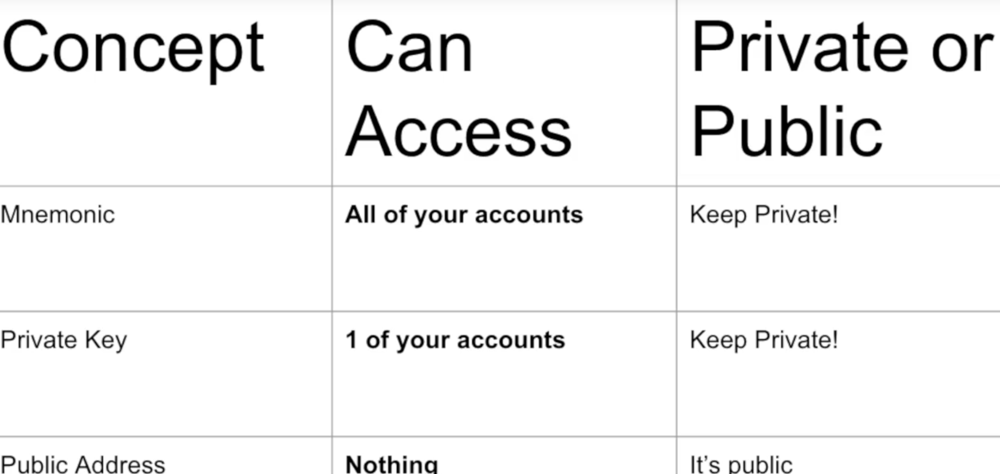

# Web3
- [Web3应用程序架构](https://www.preethikasireddy.com/post/the-architecture-of-a-web-3-0-application
)：

- [开发人员最难掌握的关于 Web 3.0 的概念](https://www.preethikasireddy.com/post/the-hardest-concept-for-developers-to-grasp-about-web-3-0
)
- 
### 权限：

# solidity

- [生命周期与EVM](docs/solidity/生命周期&EVM.md)

# ERC:

- [ERC20](docs/solidity/ERC标准/ERC20.md)

- [ERC721](docs/solidity/ERC标准/ERC721.md)

- [ERC1155](docs/solidity/ERC标准/ERC1155.md)

# ipfs

- [IPNS 服务、PIN Service](docs/ipfs/README.md)

# brownie 使用

- [包管理](docs/brownie/README.md)

