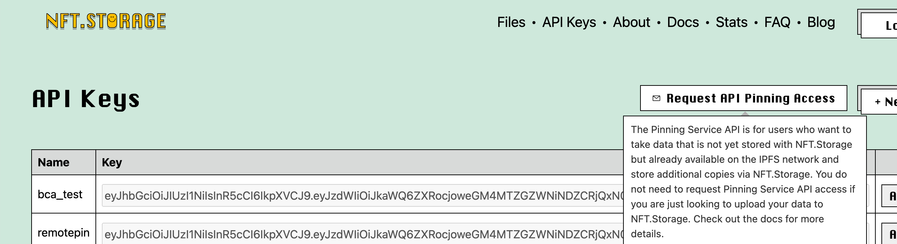

# IPFS
IPFS(InterPlanetary File System，星际文件系统），它是一种全新的超媒体文本传输协议，可以把它理解为一种支持分布式存储的网站

参考资料: [ipfs PPT.pdf](ipfsPPT.pdf) 
来源：[B站视频分享](https://www.bilibili.com/video/BV1fL4y187mS?from=search&seid=16590021780953099369&spm_id_from=333.337.0.0)

# Gateway 通用网关：
地址：
https://ipfs.github.io/public-gateway-checker/


# IPNS 如何处理目录CID变动？
[官方地址](https://docs.ipfs.io/concepts/ipns/#example-ipns-setup-with-cli)

解决文件夹变动（增删改）操作导致CID改变，Token URI地址发生改变问题。
问题：
 看了下，IPNS没有相应的服务商（需相关基础设施建设）, 目前Pinata官方告知无相关解决方案：


所以需要自己搭建,以下是一个本地节点 IPNS 搭建的示例：

```bash

# 1. 生成ipns ID
[root@iZt4na58hlqlij2bd6il00Z ~]# ipfs key gen --type=rsa --size=2048 bca_test_3
k2k4r8jvi71mdlgcz5z22i991zodwxen2xg5ogs8uxqwue9hx641fhrk

# 2. 上传一个文件夹，然后使用
[root@iZt4na58hlqlij2bd6il00Z ~]# ipfs add -r test | tail -n 1
added QmZPRAujYM4FjwLoxEkMWNTxR6L5VfkWGuvMJwSKHEgm3Q test

[root@iZt4na58hlqlij2bd6il00Z ~]# ipfs name publish --key=bca_test_3  QmZPRAujYM4FjwLoxEkMWNTxR6L5VfkWGuvMJwSKHEgm3Q
Published to k2k4r8jvi71mdlgcz5z22i991zodwxen2xg5ogs8uxqwue9hx641fhrk: /ipfs/QmZPRAujYM4FjwLoxEkMWNTxR6L5VfkWGuvMJwSKHEgm3Q

# 3. 修改文件夹，再次使用上传一个文件到文件后，再次上传
[root@iZt4na58hlqlij2bd6il00Z test]# echo "donghao" >> hello2.text
[root@iZt4na58hlqlij2bd6il00Z ~]# ipfs add -r test | tail -n 1
 32 B / 32 B [===============================================================================================================] 100.00%
 added QmRucJWpykcn85HkvPMNXU6qxroLVzTqRWjvemBfqcfXTc test
# 4.增加绑定
[root@iZt4na58hlqlij2bd6il00Z ~]# ipfs name publish --key=bca_test_3 QmRucJWpykcn85HkvPMNXU6qxroLVzTqRWjvemBfqcfXTc
Published to k2k4r8jvi71mdlgcz5z22i991zodwxen2xg5ogs8uxqwue9hx641fhrk: /ipfs/QmRucJWpykcn85HkvPMNXU6qxroLVzTqRWjvemBfqcfXTc
```

- [Temporal.cloud](https://medium.com/@rtradetech/temporal-cloud-walk-through-c477568be551) 似乎支持，不过官网很多页面都打不开，不知道是不是没运营了。

- textile 有个方案，把一个 bucket 作为一个IPNS，更新bucket数据会自动更新IPNS, 试了下，不过生成的IPNS地址无法访问(textile访问的ipfs官方ipns-service, 过程中出错了..)，所以也有问题，同时需要安装CLI工具。
```bash
[root@iZt4na58hlqlij2bd6il00Z test]# hub buck init  -n bca_test
✗ Encrypt bucket contents:
> Selected threadDB bafk6lk5ikjiaiuo6tvlrucydjmzw4ytea6uufjvu4aiurd32e5lnd3q

> Your bucket links:
> https://hub.textile.io/thread/bafk6lk5ikjiaiuo6tvlrucydjmzw4ytea6uufjvu4aiurd32e5lnd3q/buckets/bafzbeifcn6riem7n2cjzmwecehgicz32ibbjtrnqynpe3r7p4jkakzmpzq Thread link
> https://hub.textile.io/ipns/bafzbeifcn6riem7n2cjzmwecehgicz32ibbjtrnqynpe3r7p4jkakzmpzq IPNS link (propagation can be slow)
> https://bafzbeifcn6riem7n2cjzmwecehgicz32ibbjtrnqynpe3r7p4jkakzmpzq.textile.space Bucket website
> Success! Initialized /root/test as a new empty bucket


[root@iZt4na58hlqlij2bd6il00Z test]# hub buck push
> new file:  hello.text
> new file:  hello1.text
> new file:  hello2.text
Push 3 changes: y█
+ bafkreihdryr5z2zaztlxwl6t6h64ypqt3otezoqronz6q6zipedc6jndn4 hello2.text 8 B
32 B / 32 B [===========================================================================================================>] 100.00% 31s> bafybeifga5oitr5knr5xvywja2jh3r4eltczgyzk22yegsg6s7rcxlmfm4

[root@iZt4na58hlqlij2bd6il00Z test]# hub bucket links
> Your bucket links:
> https://hub.textile.io/thread/bafk6lk5ikjiaiuo6tvlrucydjmzw4ytea6uufjvu4aiurd32e5lnd3q/buckets/bafzbeifcn6riem7n2cjzmwecehgicz32ibbjtrnqynpe3r7p4jkakzmpzq Thread link
> https://hub.textile.io/ipns/bafzbeifcn6riem7n2cjzmwecehgicz32ibbjtrnqynpe3r7p4jkakzmpzq IPNS link (propagation can be slow)
> https://bafzbeifcn6riem7n2cjzmwecehgicz32ibbjtrnqynpe3r7p4jkakzmpzq.textile.space Bucket website
```


# Pinning Service
自己的IPFS节点服务关闭 & 宕机，就会获取不到数据。 IPFS 固定服务(Pinning services)会保证应用程 序数据在线（类似云服务商）

[Piñata](https://www.pinata.cloud/)  [api](https://managed.mypinata.cloud/api/v1/api-docs/#/)

[Temporal](https://temporal.cloud/)

[Eternum](https://www.eternum.io/)

[Nft.Storage](https://nft.storage/files/) 
 - 专门为nft存储设计，使用方便且Free
nft.storage 因为免费，需要发邮件申请(如果本地节点需要远程Pinning services的话)



```bash
CLI 添加一个pinningservice案例, 如添加pinata：

ipfs pin remote service add pinata https://api.pinata.cloud/psa xxx(your tk)
[root@iZt4na58hlqlij2bd6il00Z ~]# ipfs pin remote service ls
Pinata https://api.pinata.cloud/psa
[root@iZt4na58hlqlij2bd6il00Z ~]# echo "hello world" > hello.text
[root@iZt4na58hlqlij2bd6il00Z ~]# ls
hello.text
[root@iZt4na58hlqlij2bd6il00Z ~]# ipfs add hello.text
added QmT78zSuBmuS4z925WZfrqQ1qHaJ56DQaTfyMUF7F8ff5o hello.text
 12 B / 12 B [===============================================================================================================] 100.00%

[root@iZt4na58hlqlij2bd6il00Z ~]# ipfs cat QmT78zSuBmuS4z925WZfrqQ1qHaJ56DQaTfyMUF7F8ff5o
	hello world
	[root@iZt4na58hlqlij2bd6il00Z ~]# ipfs pin remote service ls
	Pinata https://api.pinata.cloud/psa

	[root@iZt4na58hlqlij2bd6il00Z ~]# ipfs pin remote add --service=Pinata  --name=hello.text QmT78zSuBmuS4z925WZfrqQ1qHaJ56DQaTfyMUF7F8ff5o
	CID:    QmT78zSuBmuS4z925WZfrqQ1qHaJ56DQaTfyMUF7F8ff5o
	Name:   hello.text
	Status: pinned
```