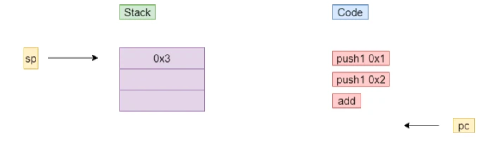

# Solidity 的生命周期
`Solidity 的代码生命周期离不开编译、部署、执行、销毁这四个阶段`


经编译后，Solidity 文件会生成字节码。这是一种类似 jvm 字节码的代码。部署时，
字节码与构造参数会被构建成交易，这笔交易会被打包到区块中，经由网络共识过程，
最后在各区块链节点上构建合约，并将合约地址返还用户。
### 编译
源代码编译完后，可以通过 ByteCode 按钮得到它的二进制：
```
608060405234801561001057600080fd5b506......
```
还可以得到对应的字节码（OpCode）:
```solidity
PUSH1 0x80 PUSH1 0x40 MSTORE CALLVALUE DUP1 ISZERO PUSH2 0x10 JUMPI PUSH1 0x0 DUP1 REVERT JUMPDEST POP PUSH1 0x40 MLOAD PUSH1 0x20 DUP1 PUSH2 0xED DUP4 CODECOPY DUP2 ADD DUP1 PUSH1 0x40 MSTORE DUP2 ADD SWAP1 DUP1 DUP1 MLOAD SWAP1 PUSH1 0x20 ADD SWAP1 SWAP3 SWAP2 SWAP1 POP POP POP DUP1 PUSH1 0x0 DUP2 SWAP1 SSTORE POP POP PUSH1 0xA4 DUP1 PUSH2 0x49 PUSH1 0x0 CODECOPY PUSH1 0x0 RETURN STOP PUSH1 0x80 PUSH1 0x40 MSTORE PUSH1 0x4 CALLDATASIZE LT PUSH1 0x3F JUMPI PUSH1 0x0 CALLDATALOAD PUSH29 0x100000000000000000000000000000000000000000000000000000000 SWAP1 DIV PUSH4 0xFFFFFFFF AND DUP1 PUSH4 0x60FE47B1 EQ PUSH1 0x44 JUMPI JUMPDEST PUSH1 0x0 DUP1 REVERT JUMPDEST CALLVALUE DUP1 ISZERO PUSH1 0x4F JUMPI PUSH1 0x0 DUP1 REVERT JUMPDEST POP PUSH1 0x6C PUSH1 0x4 DUP1 CALLDATASIZE SUB DUP2 ADD SWAP1 DUP1 DUP1 CALLDATALOAD SWAP1 PUSH1 0x20 ADD SWAP1 SWAP3 SWAP2 SWAP1 POP POP POP PUSH1 0x6E JUMP JUMPDEST STOP JUMPDEST DUP1 PUSH1 0x0 DUP2 SWAP1 SSTORE POP POP JUMP STOP LOG1 PUSH6 0x627A7A723058 KECCAK256 0x4e 0xd9 MOD DIFFICULTY 0x4c 0xc4 0xc9 0xaa 0xbd XOR EXTCODECOPY MSTORE 0xb2 0xd4 DUP7 0xdf 0xc5 0xde 0xa9 DUP1 SLT PUSH1 0xC3 CALLDATACOPY XOR 0x5d 0xad KECCAK256 0xe1 0x1f DUP2 SHL STOP 0x29 
```
例如一个函数的指令集：
```solidity
JUMPDEST DUP1 PUSH1 0x0 DUP2 SWAP1 SSTORE POP POP JUMP STOP
```
### 部署
编译完后，即可在 remix 上对代码进行部署，部署时会执行对应的构造函数。
部署成功会会得到交易回执信息，input里面就是合约二进制+构造函数参数作为输入。


### 执行
根据是否带有修饰符 `view`，可将函数分为两类：`调用`与`交易`。由于在编译期就确定了调用不会引起合约状态的变更，故对于这类函数调用，节点直接提供查询即可，
无需与其他区块链节点确认。而由于交易可能引起状态变更，故会在网络间确认。

函数没有配置 view/pure 修饰符，这意味着其可能更改合约状态。所以这个调用信息会被放入一笔交易，经由交易编码、交易签名、交易推送、
交易池缓存、打包出块、网络共识等过程，最终被交由各节点的 EVM 执行。

### 销毁
由于合约上链后就无法篡改，所以合约生命可持续到底层区块链被彻底关停。若要手动销毁合约，可通过字节码 selfdestruct。销毁合约也需要进行交易确认，在此不多作赘述。

# EVM 原理
EVM 是`栈式虚拟机`，其核心特征就是所有操作数都会被存储在栈上。
```solidity
uint a = 1;
uint b = 2;
uint c = a + b;
编译后字节码 >>>
PUSH1 0x1
PUSH1 0x2
ADD

PUSH1：将数据压入栈顶。
ADD：POP 两个栈顶元素，将它们相加，并压回栈顶。
```
下图中，sp 表示栈顶指针，pc 表示程序计数器：



### 栈

栈用于存储字节码指令的操作数。

> 局部变量若是整型、定长字节数组等类型，就会随着指令的运行入栈、出栈。


```bash
// 在下面这条简单的语句中，变量值 1 会被读出，通过 PUSH 操作压入栈顶：
uint i = 1;
```


### 内存
> 内存类似 java 中的堆，它用于储存"对象"。在 Solidity 编程中，如果一个局部变量属于变长字节数组、字符串、结构体等类型，其通常会被 memory 修饰符修饰，以表明存储在内存中。
#### 内存分配方式
memory 的分配方式非常简单，就是顺序分配
```solidity
function memAlloc() public view returns(bytes32, bytes32){
    string memory str = "aaa";
    string memory str2 = "bbb";
    bytes32 p1;
    bytes32 p2;
    assembly{
        p1 := str
        p2 := str2
    }   
    return (p1, p2);
}
```
